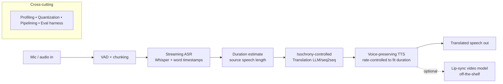

# Real-Time On-Device Speech-to-Speech Translation
### Project documentation, learning roadmap, and resource library

> **One-liner:** A real-time, on-device, orchestrated speech-to-speech translation system (English ↔ Hindi) — streaming ASR, isochrony-controlled translation, and voice-preserving TTS — quantized to run faster than real time on edge hardware, with a full evaluation suite and a cascade-vs-direct ablation.

This document is the single source of truth for the project: what it is, why it's built this way, what to learn before and during, and where every model/tool/metric lives. It is written to be dropped into a repo as `docs/PROJECT_DOCS.md`.

---

## 1. Why this project (the framing that matters)

Most "GenAI" portfolio projects are API plumbing — they call a hosted model and glue outputs together. That signals software engineering, not ML engineering. This project is deliberately positioned to signal the opposite: **model-level work** (fine-tuning, quantization, decoding modification, exposing internals) plus **systems/inference engineering** (latency, throughput, edge deployment), every step proven with a before/after number.

**Target employers:** NVIDIA, Qualcomm, AMD (systems / edge inference), Google and Meta (modeling + scale). Three of these five are hardware companies, so the center of gravity is **real-time multimodal inference on constrained hardware** — currently a scarce, heavily-funded skill set.

**The resume narrative we are building toward:**
> "Streaming English↔Hindi speech-to-speech translation. Solved isochrony with duration-aware decoding. Quantized the full stack to N× real time on [Jetson / Qualcomm / laptop]. Full eval suite + cascade-vs-direct ablation."

**What we explicitly are NOT doing:** chasing "physical AI" / "world model" buzzwords by bolting on a robot. We absorb that trend only as a *deployment philosophy* — real-time, on-device, resource-constrained.

---

## 2. System architecture

The pipeline is a **cascade** (ASR → translation → TTS) because it gives per-stage control and is what production dubbing systems still use. A **direct** end-to-end speech-to-speech model is built later purely as an ablation baseline (see Phase 6), to demonstrate awareness of where modeling is heading.

---

## 3. Model & tool choices per stage

| Stage | Default model | Why | Optimized/edge path |
|---|---|---|---|
| ASR | Whisper large-v3 | Strong multilingual incl. Hindi | faster-whisper (CTranslate2, INT8) → TensorRT |
| Word timestamps | WhisperX (wav2vec2 forced alignment) | Whisper's native timestamps are weak; alignment is needed for duration control & lip-sync | — |
| VAD / segmentation | Silero VAD | Streaming chunk boundaries | — |
| Translation | NLLB-200 or SeamlessM4T (text path) | Open, strong on Hindi-English | LoRA fine-tune for isochrony; GPTQ/AWQ INT4 |
| Voice-preserving TTS | XTTS-v2 (Coqui) | Zero-shot voice cloning from a few seconds; supports streaming | quantize + fast vocoder |
| Direct S2ST (ablation only) | SeamlessM4T v2 | Reference end-to-end baseline | — |
| Lip-sync (optional) | LatentSync / MuseTalk / Wav2Lip | Integration only — not your model | — |
| Serving | vLLM (LLM), Triton Inference Server | Continuous batching, paged attention | TensorRT-LLM engines |

> **Note on XTTS-v2 language support:** confirm current Hindi support on the model card before committing; if absent, plan a fine-tune or swap to an alternative multilingual TTS for the Hindi direction. The English direction is well covered.

---

## 4. Learning roadmap

Organized in tiers. **Tier 0–1 are blocking prerequisites — learn before you start.** Tiers 2–4 are learned *while building* the corresponding phase. Don't front-load everything; you learn inference optimization by doing it.

### Tier 0 — Foundations (blocking)

**Goal:** You cannot optimize what you do not understand. Get the transformer and the training loop into your hands, not just your head.

- **Transformer architecture, deeply** — attention, KV cache, positional encodings, encoder-decoder vs decoder-only.
  - Andrej Karpathy, *Neural Networks: Zero to Hero* (build a GPT from scratch): https://karpathy.ai/zero-to-hero.html · playlist: https://www.youtube.com/playlist?list=PLAqhIrjkxbuWI23v9cThsA9GvCAUhRvKZ
  - Umar Jamil, *Coding a Transformer from scratch (PyTorch)*: https://www.youtube.com/watch?v=bCz4OMemCcA · code/notes: https://github.com/hkproj
  - Jay Alammar, *The Illustrated Transformer*: https://jalammar.github.io/illustrated-transformer/
  - 3Blue1Brown, neural network / transformer visual series: https://www.youtube.com/@3blue1brown
  - Paper: *Attention Is All You Need* — https://arxiv.org/abs/1706.03762
- **NLP/LLM fundamentals & the HF ecosystem**
  - Hugging Face courses hub (NLP + LLM): https://huggingface.co/learn
  - Stanford CS224N (NLP w/ deep learning): https://web.stanford.edu/class/cs224n/

### Tier 1 — Speech & audio (blocking)

**Goal:** Understand audio representations and the shapes of ASR and TTS pipelines, so the timestamp and duration work makes sense.

- Sampling, mel spectrograms, vocoders; ASR (CTC vs attention decoding, forced alignment); TTS (acoustic model + vocoder, speaker embeddings, duration/prosody).
  - **Hugging Face Audio Course** (the single best fit — includes a speech-to-speech translation chapter): https://huggingface.co/learn/audio-course
  - S2S chapter source: https://github.com/huggingface/audio-transformers-course/blob/main/chapters/en/chapter7/speech-to-speech.mdx
  - Whisper (paper *Robust Speech Recognition via Large-Scale Weak Supervision*) + repo: https://github.com/openai/whisper
  - SeamlessM4T paper (great survey of cascaded vs direct S2ST): https://arxiv.org/abs/2308.11596

### Tier 2 — Modeling depth, your differentiator (learn during Phases 1–2)

**Goal:** The skills that produce the isochrony contribution and the voice cloning.

- **Fine-tuning: LoRA / QLoRA / PEFT**
  - Umar Jamil, *LoRA explained + PyTorch from scratch*: https://www.youtube.com/watch?v=PXWYUTMt-AU
  - LoRA paper: https://arxiv.org/abs/2106.09685 · QLoRA paper: https://arxiv.org/abs/2305.14314
  - HF PEFT library: https://github.com/huggingface/peft
- **Length / duration control & constrained decoding** (the isochrony problem) — search terms: "isochrony machine translation", "prosodic alignment dubbing", "length-controlled NMT". Start from the related-work sections of the SeamlessM4T paper above.
- **Voice cloning TTS** — Coqui XTTS docs: https://docs.coqui.ai/en/latest/models/xtts.html · model: https://huggingface.co/coqui/XTTS-v2

### Tier 3 — Inference & systems optimization (THE tier for NVIDIA/Qualcomm/AMD; learn during Phases 4–5)

**Goal:** Quantize, profile, and deploy. This is where the hiring signal concentrates.

- **Quantization** — PTQ vs QAT, INT8/INT4, calibration, GPTQ/AWQ/SmoothQuant.
  - Umar Jamil, *Quantization explained with PyTorch*: https://umarjamil.org/videos
  - AWQ (method + repo): https://github.com/mit-han-lab/llm-awq
- **GPU programming & profiling** — CUDA, Triton kernels, Nsight.
  - **GPU MODE** (formerly CUDA MODE) lectures — YouTube: https://www.youtube.com/@GPUMODE · code: https://github.com/gpu-mode/lectures · curated links: https://github.com/gpu-mode/resource-stream
  - Book: *Programming Massively Parallel Processors* (PMPP) — the standard CUDA text.
  - OpenAI Triton (kernel language) docs: https://triton-lang.org
  - NVIDIA Nsight Systems: https://developer.nvidia.com/nsight-systems
- **Inference engines & serving**
  - faster-whisper (CTranslate2 INT8): https://github.com/SYSTRAN/faster-whisper
  - vLLM (continuous batching, paged attention): https://github.com/vllm-project/vllm · docs: https://docs.vllm.ai
  - NVIDIA TensorRT-LLM: https://github.com/NVIDIA/TensorRT-LLM · TensorRT docs: https://docs.nvidia.com/deeplearning/tensorrt/
  - ONNX Runtime (cross-platform / edge): https://onnxruntime.ai

### Tier 4 — Edge deployment (only if targeting Qualcomm/NVIDIA edge; Phase 5)

- NPU/DSP execution, model compilation, op-support gaps, memory budgets.
  - Qualcomm AI Hub: https://aihub.qualcomm.com
  - NVIDIA Jetson + TensorRT (use the TensorRT docs above).
  - ONNX Runtime mobile/edge execution providers (link above).

### Tier 5 — MLOps / production (light, throughout)

- Docker, a streaming transport (WebRTC or websockets) for real-time, an inference API (FastAPI/gRPC).
- Experiment tracking: Weights & Biases — https://wandb.ai
- An automated evaluation harness (built in Phase 0, run every phase).

---

## 5. Phased build plan

Governing principle: **build an ugly working baseline first, measure it, then earn every optimization with a before/after number.** Don't optimize before you have a baseline. Week ranges are relative; total ≈ 3–4 months part-time.

The non-negotiable spine is Phases 0–5. Phase 6 is high-signal / low-effort. Phase 7 is optional polish. If time is short, protect Phases 4 and 5 above all — they carry the hiring signal.

| Phase | Weeks | Goal | Checkpoint | Target metric |
|---|---|---|---|---|
| **0. Scope + eval harness** | 0–1 | Pin language pair (En↔Hi) and one hardware target; build eval harness *before* the model; pick test set (FLEURS / CoVoST 2) | Harness prints a metric table on a dummy pipeline | Metrics plumbing works end-to-end |
| **1. Cascade baseline (batch, unoptimized)** | 1–3 | Whisper → NLLB/Seamless → XTTS-v2; produce target-language audio in speaker's voice | English clip in → Hindi audio in same voice out | Record *baselines*: WER, BLEU/COMET, SECS, UTMOS, RTF (will be bad) |
| **2. Isochrony (modeling differentiator)** | 3–5 | Duration-aware translation (length tokens / reranking) + TTS rate control; build duration-deviation metric | Dubbed audio lands near source duration | Median duration deviation ≈ 10–15%; BLEU/COMET retained |
| **3. Streaming (real-time identity)** | 5–7 | VAD-chunked streaming Whisper, incremental translation, streaming TTS; optional barge-in | Speak live, hear translated speech with partial results | First-audio latency < 1–2 s; steady-state RTF < 1 on dev GPU |
| **4. Inference optimization + quantization** | 7–10 | Profile (Nsight) → quantize stack (CTranslate2/TensorRT, GPTQ/AWQ, KV-cache, speculative decoding); pipeline overlap | End-to-end latency cut meaningfully | 2–4× latency/throughput gain; quality within ~2–5% of FP16 |
| **5. Edge deployment** | 10–13 | Port full pipeline to Jetson + TensorRT, or Qualcomm AI Hub/SNPE-QNN, or ONNX Runtime on a laptop-class device | Full pipeline runs on device, no cloud | RTF < 1 within device memory budget; report power/thermal if possible |
| **6. Cascade-vs-direct ablation** | 13–15 | Stand up SeamlessM4T direct S2ST; compare latency, error accumulation, quality | Clean comparison table + short analysis | A data-backed recommendation |
| **7. (Optional) Lip-sync + personalization** | 15+ | Integrate LatentSync/MuseTalk (labeled as integration); optional voice-clone continual adaptation | Polished demo video; one-command repo | LSE-C / LSE-D reported for lip-sync |

---

## 6. Evaluation metrics reference

Decide measurement **before** building, or results won't be credible.

| Stage | Metric | Meaning / tool |
|---|---|---|
| ASR | WER | Word error rate; plus word-timestamp error |
| Translation | BLEU / COMET | Quality. COMET: https://github.com/Unbabel/COMET |
| Translation (yours) | Duration deviation | % difference between target speech duration and source — the isochrony metric |
| TTS | SECS | Speaker-embedding cosine similarity (voice preservation) |
| TTS | UTMOS / MOS | Naturalness (UTMOS is an automatic MOS estimator) |
| TTS / system | RTF | Real-time factor; < 1 means faster than real time |
| Lip-sync | LSE-C / LSE-D | SyncNet-based lip-sync confidence/distance |
| System | Latency, throughput, GPU mem, power | Report before/after for every optimization |

**Datasets:** FLEURS (https://huggingface.co/datasets/google/fleurs) and CoVoST 2 cover English-Hindi speech translation with references.

---

## 7. Consolidated resource library

**Foundations**
- Karpathy Zero to Hero — https://karpathy.ai/zero-to-hero.html
- Illustrated Transformer — https://jalammar.github.io/illustrated-transformer/
- Attention Is All You Need — https://arxiv.org/abs/1706.03762
- 3Blue1Brown — https://www.youtube.com/@3blue1brown
- CS224N — https://web.stanford.edu/class/cs224n/
- HF courses — https://huggingface.co/learn

**Speech / audio**
- HF Audio Course — https://huggingface.co/learn/audio-course
- Whisper — https://github.com/openai/whisper
- faster-whisper — https://github.com/SYSTRAN/faster-whisper
- WhisperX (alignment/diarization) — https://github.com/m-bain/whisperX
- Silero VAD — https://github.com/snakers4/silero-vad
- Coqui TTS (maintained fork) — https://github.com/idiap/coqui-ai-TTS · XTTS docs — https://docs.coqui.ai/en/latest/models/xtts.html · model — https://huggingface.co/coqui/XTTS-v2
- SeamlessM4T — https://github.com/facebookresearch/seamless_communication · paper — https://arxiv.org/abs/2308.11596
- NLLB-200 models — https://huggingface.co/facebook (search "nllb-200")

**Fine-tuning**
- Umar Jamil (channel) — https://www.youtube.com/@umarjamilai · site — https://umarjamil.org/videos · code — https://github.com/hkproj
- LoRA paper — https://arxiv.org/abs/2106.09685 · QLoRA paper — https://arxiv.org/abs/2305.14314 · PEFT — https://github.com/huggingface/peft

**Systems / inference / GPU**
- GPU MODE — https://www.youtube.com/@GPUMODE · lectures — https://github.com/gpu-mode/lectures · resources — https://github.com/gpu-mode/resource-stream
- Triton (kernels) — https://triton-lang.org
- Nsight Systems — https://developer.nvidia.com/nsight-systems
- vLLM — https://github.com/vllm-project/vllm · docs — https://docs.vllm.ai
- TensorRT-LLM — https://github.com/NVIDIA/TensorRT-LLM · TensorRT docs — https://docs.nvidia.com/deeplearning/tensorrt/
- ONNX Runtime — https://onnxruntime.ai
- AWQ — https://github.com/mit-han-lab/llm-awq

**Edge**
- Qualcomm AI Hub — https://aihub.qualcomm.com

**Lip-sync (integration only)**
- LatentSync — https://github.com/bytedance/LatentSync · Wav2Lip — https://github.com/Rudrabha/Wav2Lip · MuseTalk — https://github.com/TMElyralab/MuseTalk

**Tooling**
- Weights & Biases — https://wandb.ai · COMET metric — https://github.com/Unbabel/COMET

---

## 8. Portfolio packaging (turns the repo into an asset)

The narrative interviewers remember is the quantified one. Ship:

1. **README** with the architecture diagram and the one-liner.
2. **Baseline-vs-optimized metric tables** (the whole point of Phase 0 plumbing).
3. **Two ablations** — isochrony on/off, and cascade-vs-direct.
4. **A 60-second demo video** (speak → hear yourself translated, on-device).
5. **A short technical writeup / blog post** explaining the isochrony approach and the optimization story.

> Verify all model licenses before any commercial framing (XTTS-v2 and some checkpoints are non-commercial). For a portfolio project this is fine; just label it accurately.
