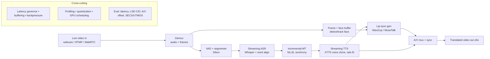

# Vaani — Real-Time Lip-Synced Video Translation Plan

**North star:** translate a *live* talking-person video stream from **English ↔ Hindi**,
regenerating the speaker's **voice** *and* **lips** so the output looks and sounds like the
person is speaking the target language — end-to-end **glass-to-glass latency ≤ 5 s**.

Inspiration: Instagram's "Translate with AI" (which re-lip-syncs the speaker), but **live /
streaming** rather than offline, under a fixed 5 s delay budget.

> Companion to [`PROJECT_DOCS.md`](PROJECT_DOCS.md) (the why/learning/resources) and
> [`RESULTS.md`](RESULTS.md) (measured numbers). This doc is the **build plan** for the video goal.

---

## 0. Success criteria (measurable)

| Dimension | Target |
|---|---|
| Glass-to-glass latency | **≤ 5 s** sustained (p95), live stream |
| Steady-state throughput | **RTF < 1** (keeps up with the stream, no unbounded lag) |
| Translation quality | spBLEU within ~2–3 of the batch cascade; COMET reported |
| Voice preservation | **SECS ≥ 0.5** *(see risk R6 — current sanity run is ~0.33)* |
| Naturalness | UTMOS ≥ 3.0 |
| Lip-sync quality | **LSE-C ↑ / LSE-D ↓** competitive with Wav2Lip/MuseTalk baselines |
| A/V sync | audio↔lip offset within ±80 ms |

Two demos define "done": **(D1)** offline file → lip-synced translated video; **(D2)** live
webcam/stream → lip-synced translated video at ≤ 5 s.

---

## 1. Where we are today

Done (Phases 0–2.5): interface-driven **cascade** ASR → MT → TTS running end-to-end on CPU,
isochrony (duration-matched output), CI/CD, and a full eval harness (WER/spBLEU/dur-dev/RTF,
plus SECS/UTMOS/COMET now wired).

- ASR: distil-large-v3 (faster-whisper, CT2 INT8) — WER ~0.058
- MT: NLLB-200 distilled 600M — spBLEU ~31
- TTS: XTTS-v2 voice cloning, isochrony rate control — dur-dev → 0.00 median
- **Batch, not streaming. CPU. RTF ~6–8 (≈ 6–8× slower than real time). No video. No lip-sync.**

The gap to the goal is large but the foundation is right: the cascade gives per-stage control,
and isochrony is exactly what keeps a *video* timeline from drifting when the translated audio
changes length.

---

## 2. Target architecture

New components vs. today: **video demux/mux, face detect+track, a streaming orchestrator with
partial hypotheses, a lip-sync model, an A/V sync layer, and a latency governor.**

---

## 3. The 5-second latency budget (why this is the hard part)

Glass-to-glass latency for one utterance is roughly the **sum** of the stages it passes through
(pipelining hides cost *across* utterances, not *within* one). A workable budget on an adequate GPU:

| Stage | Budget | Notes |
|---|---|---|
| Capture + VAD segment close | ~1.0 s | must wait for a clause/segment boundary before translating |
| Streaming ASR + word align | ~1.0 s | chunked Whisper + alignment for timing |
| Incremental MT | ~0.4 s | isochrony rerank costs ~3× a single decode — may relax when live |
| Streaming TTS (first audio) | ~0.8 s | XTTS streaming, rate-fit to segment |
| Lip-sync generation | ~1.0 s | per-frame face region; the new bottleneck |
| Mux + output buffer | ~0.3 s | |
| Jitter / slack | ~0.5 s | |
| **Total** | **~5.0 s** | leaves ~no headroom — every stage must be quantized + GPU |

**Implication:** the 5 s target is *only* reachable after optimization (Phase 4) and with a
real GPU. On the current CPU path a single utterance is already ~10 s of ASR+MT+TTS alone,
before video. Hardware (Section 5) is the gating decision.

---

## 4. Gap analysis — what's left to build

1. **Streaming** the audio cascade (partials, VAD segmentation, incremental MT, streaming TTS).
2. **Optimization**: quantize + move to GPU to fit the latency budget.
3. **Video I/O**: demux/mux, frame buffering, face detection + tracking.
4. **Lip-sync**: integrate and drive a talking-head/lip model from the translated audio.
5. **A/V sync + latency governor**: keep lips↔audio aligned and the whole thing ≤ 5 s.
6. **Edge/target-hardware** port + profiling.
7. **(Research)** cascade-vs-direct ablation.
8. **(Deferred)** website/serving backend.

---

## 5. Hardware — the critical decision (do this first)

The current dev box (RTX 3050 Ti laptop, **4 GB VRAM**) **cannot** hold Whisper + NLLB + XTTS +
a lip-sync model in memory and run them in real time. This blocks the ≤ 5 s goal regardless of
software quality. Options, in rough order of recommendation:

| Option | VRAM | Real-time feasible? | Cost | Notes |
|---|---|---|---|---|
| **Cloud GPU** (L4 / A10 / 4090, 24 GB) | 24 GB | Yes | ~$0.5–1/hr | Best for development; rent per session |
| **Your company's edge silicon** (SiMa.ai) | — | Target | — | *Strong portfolio angle* — real edge deploy, not just a laptop |
| NVIDIA Jetson Orin (16–64 GB) | 16–64 | Yes (with quant) | ~$500–2000 | Canonical edge target; TensorRT path |
| Desktop GPU (≥ 12 GB) | 12+ | Yes | one-time | Simplest local option |
| Current laptop | 4 GB | **No** (real-time) | — | Fine only for offline/file demos of single stages |

**Recommendation:** develop on a **cloud 24 GB GPU**, and pick **one edge target** (Jetson or
SiMa) for the Phase 8 deploy story. Everything below assumes a ≥ 24 GB dev GPU from Phase 4 on.

---

## 6. Phased plan, effort & ETA

**Assumptions:** solo, **part-time ≈ 3 effective engineering-days/week**. "Effort" = focused
engineering-days. Full-time compresses calendar by ~2.5×. Phases 3→7 are the spine of the video
goal; 8–9 extend it; the website is a separate deferred track.

| Phase | Goal | Key work | Effort (eng-days) | ETA (part-time) | Risk |
|---|---|---|---|---|---|
| **3. Streaming audio** | Live audio→audio translation | Silero VAD segmenter; streaming Whisper w/ partials; word-level alignment (WhisperX); incremental MT on finalized segments; XTTS streaming w/ isochrony; latency instrumentation | 10–14 | **3–4 wks** | Med |
| **4. Optimize + quantize** | Fit the compute budget | Per-stage profiling (Nsight); GPU port; INT8/INT4 (CT2/TensorRT, AWQ for MT); KV-cache; pipeline overlap; RTF<1 | 10–15 | **4–5 wks** | Med-High |
| **5. Video I/O + A/V plumbing** | Video in/out, no lip-sync yet | PyAV/ffmpeg demux/mux; face detect+track (RetinaFace/MediaPipe); pass-through (orig video + translated audio) to validate timeline/sync | 6–9 | **2–3 wks** | Low-Med |
| **6. Lip-sync integration** | Re-sync lips to translated audio | Wav2Lip baseline first (fast), then MuseTalk (real-time, better); face crop→generate→paste; LSE-C/LSE-D eval; offline file demo (**D1**) | 12–18 | **4–6 wks** | High |
| **7. Real-time E2E + 5 s budget** | Live lip-synced ≤5 s (**D2**) | Wire streaming A/V + lip-sync; buffering/backpressure; latency governor; WebRTC/websocket transport; tune to ≤5 s | 12–16 | **4–5 wks** | High |
| **8. Edge / target-hardware** | On-device real-time | Port to Jetson/SiMa; TensorRT/ONNX/QNN; op-gap fixes; power/thermal report | 10–18 | **4–6 wks** | High |
| **9. Cascade-vs-direct ablation** | Research signal | SeamlessM4T direct S2ST baseline; latency/quality/error-accumulation table | 5–8 | **2–3 wks** | Low |

**Cumulative to each demo:**
- **D1 (offline lip-synced video)** = Phases 3–6 → ~**38–56 eng-days ≈ 3.5–4.5 months** part-time.
- **D2 (live real-time ≤5 s)** = + Phase 7 → ~**50–72 eng-days ≈ 4.5–6 months** part-time.
- **Full (incl. edge + ablation)** = + Phases 8–9 → ~**65–98 eng-days ≈ 6.5–9 months** part-time.

(Full-time: D2 in roughly **2–2.5 months**.)

### Immediate pre-work (this week, cheap, do before Phase 3)
- **Merge done ✅.** Run the **full 12-clip real eval** for SECS/UTMOS (models cached now) — and
  **investigate the low SECS** (R6). Voice preservation is foundational to the video experience;
  confirm it's real before building on it. *(~0.5 day)*
- **Per-stage latency + memory profile** of the current cascade — turns Phase 4 from guessing into
  targeting. *(~1 day)*
- **Pick hardware** (Section 5) and stand up the dev GPU. *(~0.5 day)*

---

## 7. Milestones / demo checkpoints

| Milestone | After | What you can show |
|---|---|---|
| M1 | P3 | Speak live → hear yourself translated (audio only), with latency readout |
| M2 | P4 | Same, but RTF < 1 on GPU — keeps up with the stream |
| M3 | P6 | **D1:** upload a talking-head clip → download translated, lip-synced video |
| M4 | P7 | **D2:** live camera → translated lip-synced video on screen at ≤ 5 s |
| M5 | P8 | M4 running on the edge target, with a power/latency table |
| M6 | website | Anyone can try it in a browser (deferred track below) |

---

## 8. Risks & mitigations

| # | Risk | Mitigation |
|---|---|---|
| R1 | **Hardware/VRAM** can't run the full stack real-time | Decide hardware first (§5); dev on 24 GB cloud GPU; quantize aggressively (P4) |
| R2 | **Lip-sync latency** blows the 5 s budget | Start with Wav2Lip (fast); adopt MuseTalk (built for real-time); process only the face crop, not full frame |
| R3 | **Streaming MT quality** drops with small chunks | Segment on clause/sentence via VAD + punctuation; keep a context window; measure BLEU vs chunk size |
| R4 | **A/V sync drift** (translated audio ≠ source length) | Isochrony (already built) keeps target≈source duration; lip-sync is driven by the *translated* audio so lips match what's heard |
| R5 | **Lip-sync visual quality** (uncanny mouth) | Report LSE-C/D honestly; MuseTalk over Wav2Lip for quality; limit scope to head-on talking video |
| R6 | **Low SECS (~0.33)** — voice may not actually be preserved | Resolve in pre-work: 12-clip measurement; if real, try longer speaker refs / XTTS Hindi tuning / alternative TTS |
| R7 | **Licenses** (XTTS-v2, Wav2Lip non-commercial) | Portfolio use is fine; label accurately; keep a commercial-swap note |
| R8 | **Integration complexity** (P7) underestimated | Build the latency governor + buffering as a first-class component, not an afterthought; test with synthetic streams |

---

## 9. Website / serving backend (DEFERRED — build after the pipeline works)

> Explicitly out of scope until D2 is met. Captured here so the architecture leaves room for it.

**Goal:** a browser app where a user streams webcam (or uploads a clip) and gets the translated,
lip-synced video back — the pipeline above, productionized.

**Shape:**
- **Frontend:** React; webcam capture + playback; **WebRTC** for low-latency live, or upload for
  file mode; latency/subtitle overlay.
- **Transport:** WebRTC (live) / chunked HTTP (file); a signaling server.
- **Backend:** FastAPI (or gRPC) API gateway; a **job/session manager**; a GPU **worker pool**
  running the pipeline; a queue (Redis) for file jobs; object storage for artifacts.
- **Infra:** containerized (Docker) workers with the model cache mounted; autoscaling GPU nodes;
  the existing eval harness wired in as a health/quality check.
- **Concerns:** per-session GPU allocation, concurrency limits, cold-start (model load) hiding,
  auth/rate-limits, cost controls.

**Effort:** ~12–20 eng-days (~**4–6 wks** part-time) for a single-GPU MVP; more for multi-tenant
autoscaling. Sequenced **after Phase 7**, ideally after Phase 8 so the worker can target the
chosen hardware.

---

## 10. Recommended path forward (TL;DR)

1. **Pre-work now:** full SECS/UTMOS eval (+ investigate R6), per-stage profile, pick hardware.
2. **Phase 3 (streaming)** → M1: live audio translation.
3. **Phase 4 (optimize)** → M2: RTF < 1 on GPU.
4. **Phase 5 (video I/O)** → timeline/sync scaffolding.
5. **Phase 6 (lip-sync)** → **D1**, the first "wow" artifact.
6. **Phase 7 (real-time E2E)** → **D2**, the flagship ≤ 5 s live demo.
7. Then **Phase 8 (edge)**, optional **Phase 9 (ablation)**, and finally the **website**.

Protect Phases 4, 6, 7 — they carry the hardest engineering and the strongest portfolio signal
(edge inference + real-time multimodal).
